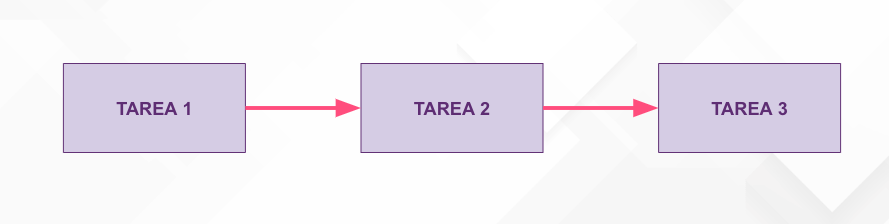

### Asincronía

La asincronía es un concepto fundamental en Javascript y es la base de esta sesión, ya que la mayoría de conceptos que aprenderemos hoy irán ligados a la asincronía.

A lo largo de las sesiones hemos ido trabajando con javascript y todas las tareas que hemos realizado en nuestros proyectos (o bueno, casi todas ya que hemos visto los temporizadores e intervalos) se han ido realizado de forma síncrona, es decir, de forma secuencial.



En esta sesión veremos que en determinados momentos será necesario realizar funciones asíncronas, no secuenciales. Javascript, al ser un lenguaje no bloqueante, las tareas no se quedan bloqueadas, si no que siguen el resto de tareas.


Este ejemplo es sencillo y únicamente queda bloqueada una tarea, pero a la hora de desarrollar programas veremos que hay varias que se entrelazarán y será necesario mecanismos que controlen esto, como pueden ser:

- los callbacks
- las promesas
- async / await

Conceptos que vamos a aprender en videos posteriores, ya que pueden darse muchas circunstancias como:

- Peticiones HTTP para obtener datos de un servidor
- Tareas con timeouts que se ejecutan a futuro
- Comunicación de javascript con sistemas externos como pueden ser sensores de un smartphone


### Ejemplo ejecución


```jsx
console.log('mensaje 1');

setTimeout(function () {
    console.log('mensaje 2');
}, 0);

const promise = new Promise(function(resolve) {
    console.log("mensaje promesa 1");
    resolve('mensaje promesa 2')
});

promise.then((value) => console.log(value))

console.log('mensaje 3');
```

 

- Se ejecuta primero el **mensaje 1**
- El callback del timeout se va a la cola de macrotask
- Se ejecuta el console de la promesa **mensaje promesa 1**
- El resolve de la promesa va a la a lista de microtask
- Se ejecuta el **mensaje 3**
- Se ejecuta **mensaje promesa 2** de la microtask
- Se ejecuta **mensaje 2** del callback
